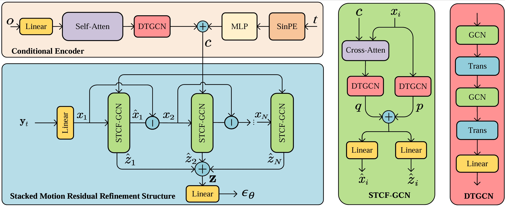

# SMRNet
**SMRNet: Stacked Motion Residual Learning with Spatiotemporal Modeling in Diffusion Models for Human Motion Prediction** 

### Abstract
------
Human motion prediction (HMP) is a widely adopted technique for forecasting future human motions based on historical movements. Recent advancements employing diffusion models offer the benefits of straightforward training and the ability to handle diverse human motions. However, existing works often fail to fully utilize the motion data and effectively incorporate spatiotemporal constraints, resulting in overly diverse motions that deviate from the input. In this paper, we propose a novel Stacked Motion Residual Network (SMRNet) based on diffusion models to address the aforementioned issues. Specifically, we first introduce a novel stacked motion residual refinement structure, which is constructed by stacking multiple Spatiotemporal Cross-Fused Graph Convolutional Networks (STCF-GCN) through a layer-wise residual correction framework. Through this framework, the model incrementally refines human motions via residual learning. Each layer is designed to correct the residuals that the previous layer could not resolve, thereby effectively integrating and leveraging valuable information in the data. Furthermore, the STCF-GCN module simultaneously accounts for the dependencies between human joints and the temporal correlations throughout the motion, explicitly capturing the spatiotemporal constraints in the input sequences. Finally, we achieve significantly more accurate and faithful predictions. On two commonly used datasets, Human3.6M and HumanEva-I, we demonstrate that our method outperforms state-of-the-art methods in terms of Average Displacement Error (ADE) and Final Displacement Error (FDE). It is also more compact and achieves a 36.13% reduction in computational complexity.
A series of ablation studies further validate the effectiveness of SMRNet.

### Network Architecture
------


### Requirements
------
- PyTorch = 1.7.1
- CUDA = 12.2
- Python = 3.8.0

### Data Preparation
------
Download public datasets Human3.6M and HumanEva-I in NPZ format from [data](https://drive.google.com/drive/folders/1sb1n9l0Na5EqtapDVShOJJ-v6o-GZrIJ). Create a folder named data in the main directory. The contents of the file are as follows:

```shell script
data
├── data_3d_h36m.npz
├── data_3d_humaneva15.npz
├── data_multi_modal
│   ├── data_candi_t_his25_t_pred100_skiprate20.npz
│   └── t_his25_1_thre0.500_t_pred100_thre0.100_filtered_dlow.npz
└── humaneva_multi_modal
    ├── data_candi_t_his15_t_pred60_skiprate15.npz
    └── t_his15_1_thre0.500_t_pred60_thre0.010_index_filterd.npz
```

### Environment Setup
Run the install script file:

```
sh install.sh
```


### Train

For Human3.6M: 

```
python main.py --cfg h36m --mode train
```

For HumanEva-I: 

```
python main.py --cfg humaneva --mode train
```


### Evaluation 

Evaluate on Human3.6M: 

```
python main.py --cfg h36m --mode eval --ckpt ./checkpoints/h36m_ckpt.pt
```

Evaluate on HumanEva-I: 

```
python main.py --cfg humaneva --mode eval --ckpt ./checkpoints/humaneva_ckpt.pt
```


------
### Visualization

The visualization results can be found in folder demo.

For Human3.6M:

```
python main.py --cfg h36m --mode pred --vis_row 3 --vis_col 10 --ckpt ./checkpoints/h36m_ckpt.pt
```

For HumanEva-I: 

```
python main.py --cfg humaneva --mode pred --vis_row 3 --vis_col 10 --ckpt ./checkpoints/humaneva_ckpt.pt
```


#### Ackowlegments
The implementation is developed based on [HumanMAC](https://github.com/LinghaoChan/HumanMAC).
